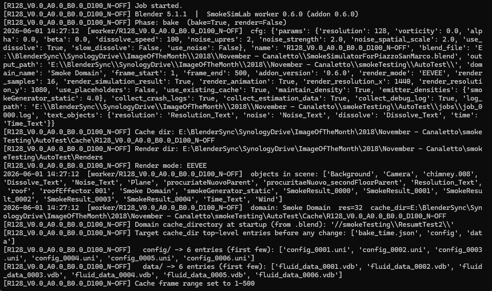
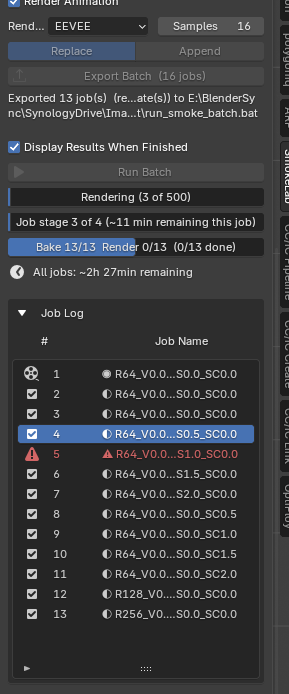
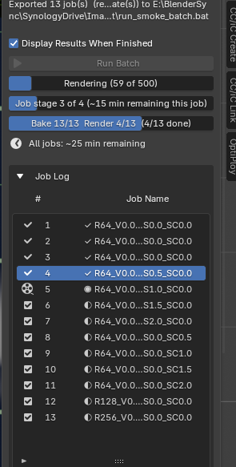

# BatchSimLab — Full Documentation

A Blender 4.x/5.x add-on for **batch fluid-simulation parameter sweeping**. You
define parameter ranges in a panel, click **Export Batch**, and a Windows batch
file runs every combination — baking the Mantaflow simulation, rendering a
playblast animation and a final still, and logging results to CSV for comparison.

> **Naming:** the product is **BatchSimLab** (repo + source folder
> `BatchSimLab`). Some lowercase runtime identifiers still use the legacy `smoke`
> prefix (`scene.smoke_settings`, `SMOKE_*` operators, `.smokesettings` presets)
> for backwards compatibility with existing `.blend` saves and keymaps. The
> Blender extension id is `batchsimlab`.

This page is the complete reference. For a short overview see
[README.md](README.md).

---

## Contents

1. [Requirements](#requirements)
2. [Installation](#installation)
3. [Quick start](#quick-start)
4. [Concepts: jobs, passes, and the two-phase pipeline](#concepts)
5. [Parameter reference](#parameter-reference)
   - [Domain / gas](#domain--gas)
   - [Dissolve](#dissolve)
   - [Noise](#noise)
   - [Gas timing (time scale / adaptive timesteps)](#gas-timing)
   - [Fire](#fire)
   - [Emitters / flow objects](#emitters--flow-objects)
6. [Iteration modes](#iteration-modes)
7. [Render settings](#render-settings)
8. [Text overlays](#text-overlays)
9. [Output structure](#output-structure)
10. [results.csv schema (23 columns)](#resultscsv-schema)
11. [Caching, resume, and placeholders](#caching-resume-and-placeholders)
12. [Job Log, progress bars, and estimates](#job-log-progress-and-estimates)
13. [Presets](#presets)
14. [Troubleshooting](#troubleshooting)
15. [Known limitations](#known-limitations)

---

## Requirements

- **Blender 4.2 or later** for the extension install (tested on 4.5.x LTS and
  5.1.1). The legacy `bl_info` add-on path works on 4.0+ but the extension feed
  is the supported route.
- **Windows** — the batch launcher is a `.bat` file. Linux/macOS would need a
  shell-script adaptation of the launcher.
- An NVIDIA GPU with OptiX is recommended for fast Cycles rendering but is not
  required.

---

## Installation

BatchSimLab ships as a **Blender extension** served from a self-hosted feed
(GitHub Pages). This is the supported install:

1. **Edit → Preferences → Get Extensions**.
2. Open the **Repositories** dropdown (top-left ▾) → **＋ Add Remote Repository**.
3. Paste the feed URL:
   ```
   https://rickpalo.github.io/BatchSimLab/index.json
   ```
4. Enable the repository, then find **BatchSimLab** in **Get Extensions** and
   click **Install**. Future versions update automatically from the feed.
5. The **BatchLab** tab appears in the 3D Viewport N-panel (press **N**).

> Installing from a downloaded `.zip` (Get Extensions → ▾ → *Install from Disk…*)
> also works if you have a `batchsimlab-<version>.zip` build.

---

## Quick start

1. Set up a Mantaflow smoke/fire domain in your scene.
2. Open the **BatchLab** tab in the N-panel.
3. Set **Domain Object** to your fluid domain.
4. Set **Output** to a folder where results will be written.
5. Configure parameter defaults and any **ranges/lists** you want to sweep.
6. **Save your `.blend`** (the launcher needs the absolute path).
7. Click **Export Batch** — writes the batch files to your output folder.
8. Double-click `run_smoke_batch.bat` in Windows Explorer (or click **Run Batch**).

Monitor progress in the **Job Log** section; it updates automatically.

---

## Concepts

**Job** — one parameter combination. Each job bakes a simulation cache and
(unless bake-only) renders a playblast MP4 + a final still PNG, and appends one
row to `results.csv`.

**Two-phase pipeline.** The exported `.bat` runs in two passes:

1. **Bake pass** — every job is baked headless (`--background`).
2. **Render pass** — every job is then rendered (EEVEE runs windowed; Cycles can
   run headless).

This ordering lets all bakes complete headlessly before the (sometimes windowed)
render pass begins. It is why, mid-bake, the Job Log shows `Bake 10/25  Render
0/25` — no job is fully *done* until its render completes in pass 2. In
**bake-only** mode (Render Simulation Result off) the render pass is omitted and
the bake pass is final.

Each job runs in a fresh Blender instance via a **crash-safe launcher**
(`smoke_launcher.py`) that detects WerFault crash dialogs, enforces a stale-log
watchdog, and marks a failed job rather than hanging the batch.

---

## Parameter reference

Every numeric parameter can be a single **Value**, a **Range** (begin/end/step),
or an explicit **List** of values. Which ones are swept, and how they combine,
depends on the [iteration mode](#iteration-modes).

### Domain / gas

| Parameter | Blender attribute | Default | Notes |
|---|---|---|---|
| Resolution | domain `resolution_max` | 32 | Longest-side grid divisions. Higher = more detail, much longer bakes. |
| Vorticity | `d.vorticity` | 0.0 | Turbulent swirling detail. |
| Buoyancy Density | `d.alpha` | 1.0 | How much smoke density drives upward buoyancy. |
| Buoyancy Heat | `d.beta` | 1.0 | How much temperature drives upward buoyancy. |

### Dissolve

When enabled, smoke fades over time. Controlled by **dissolve speed** (frames)
and an optional **slow (logarithmic)** mode. Enable **Iterate Both On and Off**
to add one extra job with dissolve disabled for a direct comparison.



### Noise

Adds high-resolution turbulent detail on top of the base sim. Sub-parameters:

| Parameter | Blender attribute | Default | Notes |
|---|---|---|---|
| Upres / Scale | `d.noise_scale` | 2 | Upres factor — how much finer the noise grid is. |
| Strength | `d.noise_strength` | 2.0 | Intensity of the noise detail. |
| Position Scale | `d.noise_pos_scale` | 2.0 | Spatial frequency of the noise pattern. |

Enable **Iterate Both On and Off** to add one extra job with noise disabled.

> **Bake ceiling:** the effective noise grid is `resolution × upres`. Above
> ~512³ effective, Mantaflow's noise bake can crash or hang. BatchSimLab warns
> (non-blocking) when a job would cross that threshold.

### Gas timing

(v0.7.0) Controls how Mantaflow advances time.

| Parameter | Blender attribute | Default | Notes |
|---|---|---|---|
| Time Scale | `d.time_scale` | 1.0 | Simulation speed multiplier. |
| Adaptive Timesteps | `d.use_adaptive_timesteps` | on | Master toggle for the three below. |
| CFL Number | `d.cfl_condition` | 4.0 | Stability target; lower = more substeps. |
| Timesteps Max | `d.timesteps_max` | 4 | |
| Timesteps Min | `d.timesteps_min` | 1 | |

When Adaptive Timesteps is off, the CFL/min/max columns are logged as `OFF`.

### Fire

(v0.7.0) Enable **Use Fire** to sweep combustion parameters.

| Parameter | Blender attribute | Default |
|---|---|---|
| Burning Rate | `d.burning_rate` | 0.75 |
| Flame Smoke | `d.flame_smoke` | 1.0 |
| Flame Vorticity | `d.flame_vorticity` | 0.5 |
| Flame Max Temp | `d.flame_max_temp` | 3.0 |
| Flame Ignition | `d.flame_ignition` | 1.5 |

When Use Fire is off, all fire columns are logged as `OFF`.

### Emitters / flow objects

(v0.9.0) BatchSimLab can also sweep **per-emitter flow settings**. Because a
domain has no back-reference to its emitters, the add-on scans the scene for
`FLUID`-modifier **FLOW** objects whose world bounding box overlaps the domain,
and lists them in a collapsible **Emitters** section (auto-populated on
domain-select; a **Refresh Emitters** button re-scans).

Per emitter, these can be a Value / Range / List:

- Initial Temperature
- Density (smoke `density`)
- Surface Emission (`surface_distance`)
- Volume Emission (`volume_density`)
- Initial Velocity — with optional Source / Normal / Initial XYZ components

> Emitter values are encoded into each **job name** (e.g. `…E0SE10_E0VE1`) and
> shown in the [text overlays](#text-overlays) — they are **not** separate
> `results.csv` columns (the CSV is domain-level). Single-domain batches only.

---

## Iteration modes

**Limited Combinations** (default) — for each parameter that has a range/list,
one group of jobs is created where *that* parameter sweeps while all others stay
at their default. Total jobs = sum of all range lengths.

> Example: Vorticity `[0.5, 1.0, 1.5]` + Noise Strength `[0.5, 1.0, 1.5]` →
> 3 (vary vorticity) + 3 (vary noise) = **6 jobs**.

**All Combinations** — full Cartesian product. Same example: 3 × 3 = **9 jobs**.
Grows quickly with more swept parameters.

For emitters: a **Limited** sweep varies one emitter axis at a time; an **All**
sweep crosses emitter values into the domain product.

---

## Render settings

| Mode | Speed | Requirements |
|---|---|---|
| Cycles GPU | Medium | Works headless (`--background`); OptiX → CUDA → HIP fallback. |
| EEVEE | Fast | Renders in a visible window (the render pass runs windowed for EEVEE). |

- **Render Samples** — per-job sample count (applied to both EEVEE
  `taa_render_samples` and Cycles `samples`).
- **Render Simulation Result** — uncheck for a **bake-only** batch (validate
  caches now, render later). The engine/sample controls grey out.
- **Render Animation** — the MP4 playblast pass.

Renders are written as a PNG sequence first, then encoded to MP4 (avoids a
Blender headless FFMPEG limitation), plus a final still PNG.

---

## Text overlays

BatchSimLab updates scene **FONT** objects with the current parameter values
before each render, so they appear burned into the output. Objects not present
are silently skipped.

| Field | Default object | Example |
|---|---|---|
| Resolution | `Resolution_Text` | `Res: 128 / Vort: 0.05, Dens: 1, Heat: 1` |
| Noise | `Noise_Text` | `Noise: U-2 \| St-2.5 \| Scale-0.04` |
| Dissolve | `Dissolve_Text` | `Dissolve: Time: 400 \| Slow-Yes` (emitter settings prepended) |
| Bake Time | `Time_Text` | `Bake: 5 min 29 sec` |

Emitter settings (when present) are prepended to the Dissolve/Time overlays, e.g.
`smokeGenerator_static: Init Temp-1, Dens--2, SurfE-10, VolE-1`.

---

## Output structure

```
<output_path>/
    run_smoke_batch.bat         ← double-click to run
    smoke_worker.py             ← copy of the worker (do not edit)
    smoke_launcher.py           ← crash-safe wrapper (do not edit)
    jobs/
        job_0000.json           ← parameters for job 0
        job_0000.log            ← console output (unified across both passes)
        job_0000.bake.done      ← bake-pass marker
        job_0000.render.done    ← render-pass marker
        job_0000.done           ← final (unphased) completion marker
        ...
    Renders/
        <jobname>.mp4           ← playblast animation
        <jobname>.png           ← final still frame
        results.csv             ← all job parameters + bake time + version
    Cache/
        <jobname>/              ← per-job simulation cache (data/ + noise/)
    estim_log.jsonl             ← estimate-vs-actual log (if enabled)
    perf_log.json               ← per-job performance records (render pass)
```

> Marker files: the two-pass pipeline writes `.bake.done` / `.render.done` per
> phase (and `.bake.crashed` / `.render.crashed` on failure). The unphased
> `.done` alias is written by the **final** pass so legacy tooling still sees a
> single completion marker.

---

## results.csv schema

The worker writes **23 columns** (`smoke_worker.py`). The `version` column is
always last so readers that index from the end keep working; new fields were
inserted before it. When a master toggle is off, its dependent columns are `OFF`.

| # | Column | Notes |
|---|---|---|
| 1 | `name` | Job filename stem (encodes all swept values, incl. emitters). |
| 2 | `resolution` | Domain resolution. |
| 3 | `vorticity` | |
| 4 | `alpha` | Buoyancy density. |
| 5 | `beta` | Buoyancy heat. |
| 6 | `dissolve_speed` | or `OFF`. |
| 7 | `slow_dissolve` | or `OFF`. |
| 8 | `noise_upres` | or `OFF`. |
| 9 | `noise_strength` | or `OFF`. |
| 10 | `noise_spatial_scale` | or `OFF`. |
| 11 | `time_scale` | |
| 12 | `use_adaptive_timesteps` | |
| 13 | `cfl_number` | or `OFF`. |
| 14 | `timesteps_max` | or `OFF`. |
| 15 | `timesteps_min` | or `OFF`. |
| 16 | `use_fire` | |
| 17 | `burning_rate` | or `OFF`. |
| 18 | `flame_smoke` | or `OFF`. |
| 19 | `flame_vorticity` | or `OFF`. |
| 20 | `flame_max_temp` | or `OFF`. |
| 21 | `flame_ignition` | or `OFF`. |
| 22 | `bake_seconds` | Bake time in seconds. |
| 23 | `version` | Addon version that produced the row. |

---

## Caching, resume, and placeholders

- **Use Existing Cache** — reuse a matching cache instead of re-baking. The
  worker verifies the cached frame range; if every needed frame is present it
  logs `SKIP BAKE`. If the cache is incomplete or corrupt it re-bakes.
- **Use Placeholders** — render with existing cache and insert placeholder images
  for any uncached frames.
- **Auto Retry Failed** — re-run a failed job once before marking it failed.
- **Monitor Existing Jobs** — reconnect to an already-running batch after closing
  and reopening Blender; rebuilds the Job Log and resumes monitoring.
- **Retry Failed Jobs** (Utilities) — re-run every job that isn't cleanly
  finished: those whose final completion marker reports an error, **and** those
  that never finished at all (no final `.done` — e.g. the batch was interrupted
  or a job never started). Writes and launches `run_retry_failed.bat` with **Use
  Placeholders** and **Use Existing Cache** forced on, so each retry resumes from
  where the job last succeeded (a fully-baked-but-unrendered job skips the bake).
  The latest attempt wins — a successful retry clears an earlier failure. Enabled
  once a run has produced any per-job output; if every job completed cleanly it
  reports "No failed or unfinished jobs found". (This is the manual, whole-batch
  equivalent of **Auto Retry Failed**, available any time after a run.)

Cache safety: every swept parameter (including emitters) is encoded into the job
name, so distinct jobs get distinct cache directories — no cross-job cache
collisions.

---

## Job Log, progress, and estimates

The **Job Log** lists each job with a live status (Not Started / In Progress /
Baked / Rendering / Complete / Failed / Crashed) and auto-scrolls to the active
job.



Three progress bars show, per active job, the current sub-task (e.g. "Baking
noise"), the per-job stage estimate ("Job stage 2 of 4"), and overall batch
progress. The **All jobs** ETA is **phase-aware**: it counts down during both the
bake pass and the render pass.



> Time estimates use built-in rate constants (`_BAKE_RATE_*`, `_RENDER_RATE_*`)
> and are continually being calibrated; treat them as guidance. EEVEE estimates
> are reasonably accurate; Cycles estimates are still being tuned.

---

## Presets

Save and load named `.smokesettings` files to recall full parameter
configurations. **Reset To Defaults** restores all settings and clears the Job
Log in one click.

---

## Troubleshooting

**"smoke_worker.py not found" on Export**
Re-install the add-on — `__init__.py`, `smoke_worker.py`, and `smoke_launcher.py`
must be installed together (they are bundled in the extension zip).

**Batch crashes immediately with EXCEPTION_ACCESS_VIOLATION**
Some installed add-ons crash in background mode. `--factory-startup` (used by the
launcher) prevents most cases. Check `jobs/job_0000.log` for the last line before
the crash; `blender_stderr.txt` in the output folder may hold a traceback.

**"Cache files found: 0" after bake**
Mantaflow completed but wrote nothing. Often a path with special characters, or
domain settings not applied. Check the job log for errors.

**Playblast takes a long time**
Lower **Render Samples** in Render Settings before exporting.

**Physics panel resolution greyed out after a batch**
The domain points at a job cache directory. Click **Free All** in Physics
Properties → Fluid and re-point the cache directory to your working folder.

**"Helper file version mismatch — re-run Export Batch"**
Means the exported `smoke_worker.py` / `smoke_launcher.py` predate your installed
add-on; re-run Export Batch. (A phantom version of this warning for the launcher
was fixed in v0.9.4 — see BUG-017.)

---

## Known limitations

- `bpy.ops.fluid.bake_all()` can crash in `--background` on some Blender builds
  with certain add-ons installed; `--factory-startup` resolves most cases.
- EEVEE cannot render in background mode — the render pass runs windowed for
  EEVEE; use Cycles for fully headless batches.
- The launcher is **Windows-only** (`.bat`).
- **Single-domain** batches only (emitter discovery assumes one domain).
- Noise bakes above ~512³ effective grid may crash/hang (warned, not blocked).
- Resuming a bake after a Blender upgrade may fail if the VDB format changed;
  re-bake from scratch.
