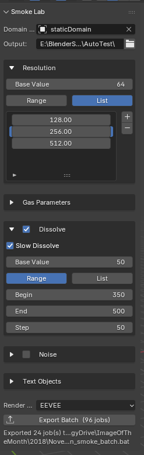

# SmokeSimLab

A Blender 4.x addon for batch smoke simulation parameter sweeping.

SmokeSimLab automates the tedious process of testing many different smoke simulation settings. You define parameter ranges in a panel, click Export Batch, and a Windows batch file runs every combination — baking the simulation, rendering a playblast animation and a final still, and logging results to CSV for comparison.



---

## Features

- **Batch parameter sweeping** across Resolution, Vorticity, Buoyancy Density, Buoyancy Heat, Dissolve Speed, and three Noise parameters
- **Two iteration modes:**
  - _Limited Combinations_ — vary one parameter at a time while all others hold at their default value (far fewer jobs)
  - _All Combinations_ — full Cartesian product of all ranges
- **Per-job outputs:** MP4 playblast, PNG final still, and a row in `results.csv`
- **In-render text object updates** — scene FONT objects display the current parameter values in each render
- **Cycles GPU rendering** (OptiX → CUDA → HIP fallback) in background mode, or EEVEE in windowed mode
- **OpenVDB + Blosc cache** format for compact, fast cache files
- **Per-job log files** so nothing is lost if the batch window closes

---

## Requirements

- **Blender 4.0 or later** (tested on Blender 4.5.5 LTS)
- **Windows** (the batch launcher is a `.bat` file; Linux/Mac support requires a shell script adaptation)
- An NVIDIA GPU with OptiX support is recommended for fast playblast rendering but is not required

---

## Installation

1. Download the latest `SmokeSimLab.zip` from the [Releases](https://github.com/YOUR_USERNAME/SmokeSimLab/releases) page.
2. In Blender, open **Edit → Preferences → Add-ons**.
3. Click **Install** and select `SmokeSimLab.zip`.
4. Enable the **SmokeSimLab** addon in the list.
5. The **SmokeLab** tab will appear in the 3D Viewport N-panel (press **N** to open it).

---

## Quick Start

1. Set up your smoke simulation scene with a Mantaflow fluid domain object.
2. Open the **SmokeLab** tab in the N-panel.
3. Set **Domain Object** to your fluid domain.
4. Set **Output** to a folder where results will be written.
5. Configure parameter defaults and any ranges you want to sweep.
6. **Save your .blend file** (the batch launcher needs the absolute path).
7. Click **Export Batch** — this writes files to your output folder.
8. Double-click `run_smoke_batch.bat` in Windows Explorer.

Each job opens a fresh Blender instance, bakes the simulation, renders, and exits. You can monitor progress by watching the `jobs/` folder fill with `.log` files.

---

## Output Structure

```
<output_path>/
    run_smoke_batch.bat         ← double-click to run
    smoke_worker.py             ← copy of the worker script (do not edit)
    jobs/
        job_0000.json           ← parameters for job 0
        job_0000.log            ← console output from job 0
        job_0001.json
        job_0001.log
        ...
    Renders/
        R64_V1.0_A1.0_...0000.mp4   ← playblast animation
        R64_V1.0_A1.0_...0000.png   ← final still frame
        results.csv                  ← all job parameters + bake times
    Cache/
        R64_V1.0_A1.0_...0000/      ← per-job simulation cache
            Data/
            Noise/                   ← (if noise enabled)
```

---

## Parameter Reference

### Resolution

The longest side of the fluid domain grid. Higher = more detail, much longer bake times. Blender default is 32.

### Gas Parameters

| Parameter        | Blender Attribute | Default | Description                                                  |
| ---------------- | ----------------- | ------- | ------------------------------------------------------------ |
| Vorticity        | `d.vorticity`     | 1.0     | Turbulent swirling detail. 0 = smooth, higher = more chaotic |
| Buoyancy Density | `d.alpha`         | 1.0     | How much smoke density drives upward buoyancy                |
| Buoyancy Heat    | `d.beta`          | 1.0     | How much temperature drives upward buoyancy                  |

### Dissolve

When enabled, smoke fades out over time. Controlled by dissolve speed (frames) and optional logarithmic (slow) mode.

### Noise

Adds high-resolution turbulent detail on top of the base simulation. Controlled by three sub-parameters:

| Parameter      | Blender Attribute   | Default | Description                                     |
| -------------- | ------------------- | ------- | ----------------------------------------------- |
| Scale          | `d.noise_scale`     | 2       | Upres factor — how much finer the noise grid is |
| Strength       | `d.noise_strength`  | 1.0     | Intensity of the noise detail                   |
| Position Scale | `d.noise_pos_scale` | 1.0     | Spatial frequency of the noise pattern          |

### Iteration Modes

**Limited Combinations** (default): For each parameter that has a range defined, one group of jobs is created where that parameter sweeps its range while all others stay at their default value. Total jobs = sum of all range lengths.

Example: Vorticity range [0.5, 1.0, 1.5] + Noise Strength range [0.5, 1.0, 1.5]:

- 3 jobs sweeping vorticity (noise strength = default)
- 3 jobs sweeping noise strength (vorticity = default)
- **Total: 6 jobs**

**All Combinations**: Full Cartesian product. Same example: 3 × 3 = **9 jobs**. With many parameters this grows very quickly.

### Render Modes

| Mode       | Speed  | Requirements                                    |
| ---------- | ------ | ----------------------------------------------- |
| Cycles GPU | Medium | Works in `--background` mode; uses OptiX/CUDA   |
| EEVEE      | Fast   | Requires windowed mode (visible Blender window) |

---

## Text Objects

SmokeSimLab can update FONT (text) objects in your scene with current parameter values before each render, so the values appear in the rendered output.

Set the object names in the **Text Objects** section. Objects not found in the scene are silently skipped.

| Field      | Default Name      | Example Value                       |
| ---------- | ----------------- | ----------------------------------- |
| Resolution | `Resolution_Text` | `Res: 64`                           |
| Noise      | `Noise_Text`      | `Noise: U-2 \| St-1.0 \| Scale-1.0` |
| Dissolve   | `Dissolve_Text`   | `Dissolve: Time: 50 \| Slow-No`     |
| Bake Time  | `Time_Text`       | `Bake: 5 min 23 sec`                |

---

## results.csv Columns

| Column              | Description                             |
| ------------------- | --------------------------------------- |
| name                | Job filename stem                       |
| resolution          | Domain resolution                       |
| vorticity           | Vorticity value used                    |
| alpha               | Buoyancy density value used             |
| beta                | Buoyancy heat value used                |
| dissolve_speed      | Dissolve speed in frames (or OFF)       |
| slow_dissolve       | Whether slow dissolve was used (or OFF) |
| noise_upres         | Noise scale factor (or OFF)             |
| noise_strength      | Noise strength (or OFF)                 |
| noise_spatial_scale | Noise position scale (or OFF)           |
| bake_seconds        | Bake time in seconds                    |

---

## Troubleshooting

**Export Batch shows "smoke_worker.py not found"**
Re-install the addon — both `__init__.py` and `smoke_worker.py` must be installed together.

**Batch crashes immediately with EXCEPTION_ACCESS_VIOLATION**
Your installed Blender addons may be crashing in background mode. The `--factory-startup` flag should prevent this, but some addons ignore it. Check `jobs/job_0000.log` for the last output line before the crash.

**Cache files found: 0 after bake**
The Mantaflow bake completed but wrote nothing to disk. This can happen if the cache directory path contains special characters, or if the domain settings were not applied correctly. Check the log for error messages.

**Playblast takes 20+ minutes**
The Cycles sample count is set to 32 by default. For faster playblasts at the cost of quality, edit `smoke_worker.py` and reduce `scene.cycles.samples = 32` to a lower value such as 8 or 16. Re-export after changing the worker.

**Physics panel resolution is greyed out after batch**
The domain is pointing at a job cache directory. Click **Free All** in Physics Properties → Fluid, then point the cache directory back to your working folder.

---

## Known Limitations

- `bpy.ops.fluid.bake_all()` crashes in `--background` mode on some Blender 4.5 builds with certain addons installed. `--factory-startup` resolves this in most cases.
- EEVEE rendering is not available in background mode — use Cycles GPU instead, or switch to windowed mode.
- Cache files baked in Blender 4.x may not be readable in Blender 5.x due to the compression format change (LZMA → ZSTD). Re-bake when upgrading Blender versions.
- The batch launcher is Windows-only (`.bat`). Linux/Mac users can adapt the launcher to use a shell script.

---

## License

MIT License. See [LICENSE](LICENSE) for details.

---

## Contributing

Bug reports and pull requests are welcome on the [GitHub repository](https://github.com/YOUR_USERNAME/SmokeSimLab).
